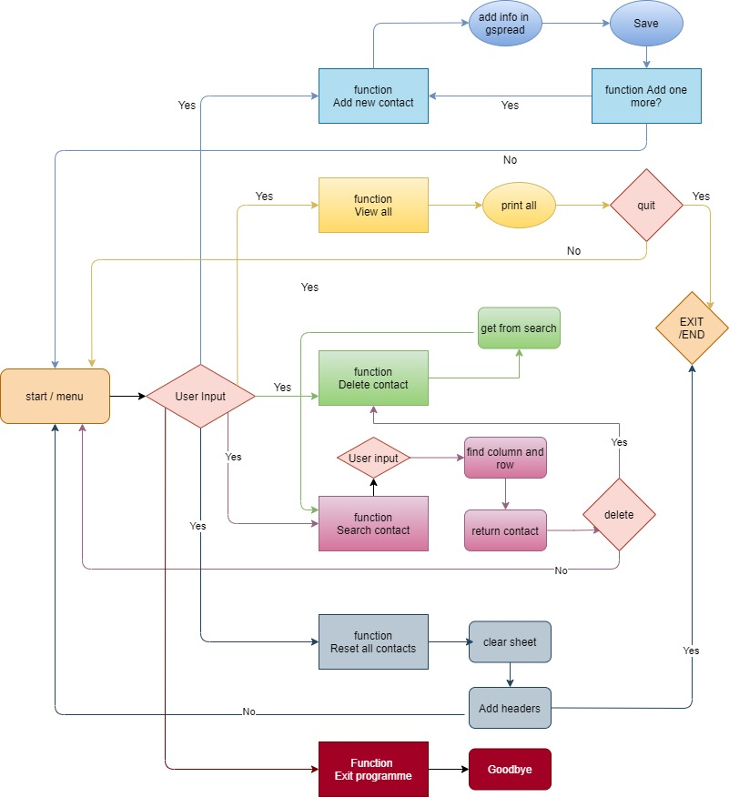
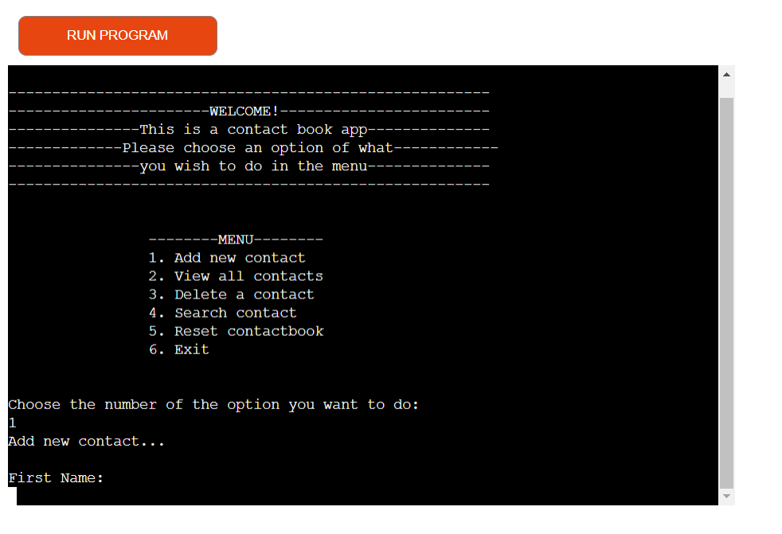
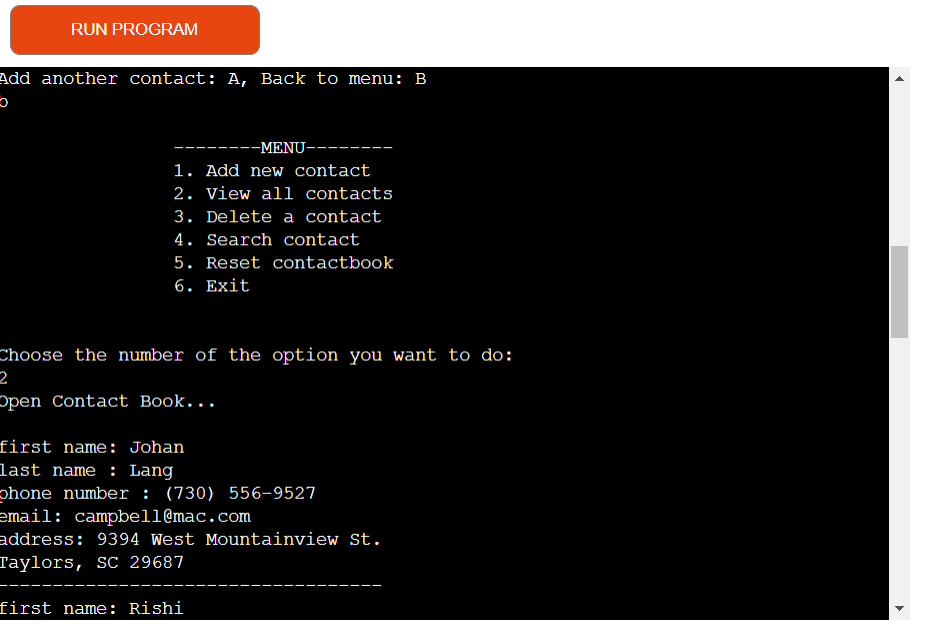
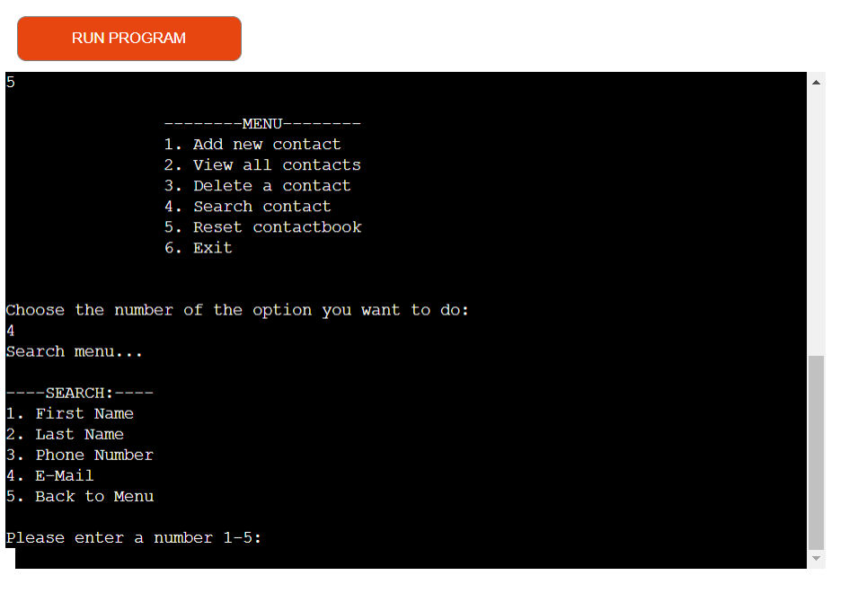
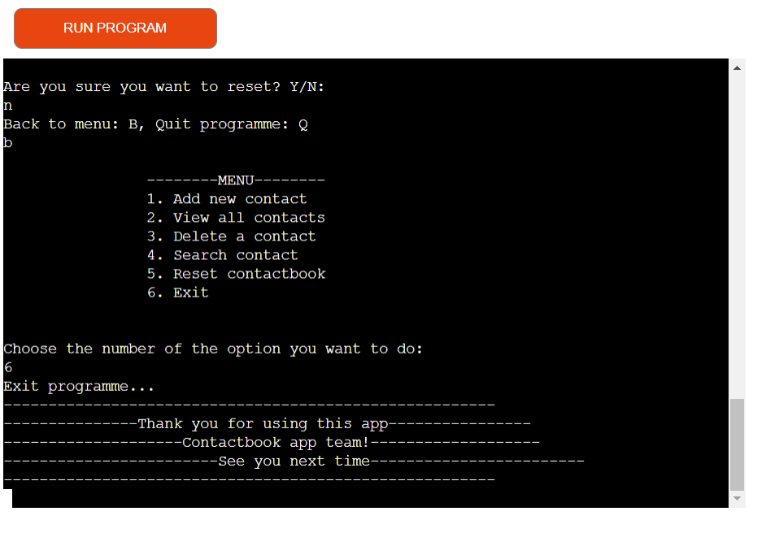
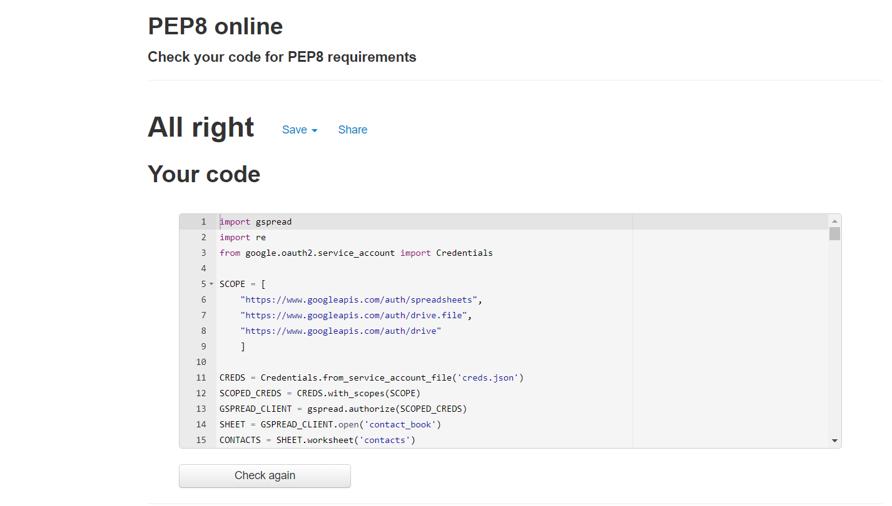

# Content
* [Project Description](#Project-Description)
* [UX](#UX)
  - [User Stories](#User-Stories)
  - [Site Owner Goals](#Site-Owner-Goals)
  - [Structure](#Structure)
* [Features](#Features)
  - [Existing Features](#Existing-Features)
  - [Features Left To Implement](#Features-Left-To-Implement)
* [Technologies Used](#Technologies-Used)
  - [Languages](#Languages)
  - [Other Programmes](#Other-Programmes)
* [Testing](#Testing)
  - [Validator Testing](#Validator-Testing)
  - [Bug and fix](#Bug-and-fix)
* [Deployment](#Deployment)
* [Credits](#Credits)
* [Ackmowledgements](#Ackmowledgements)
# Project Description
This project is developed as my third portfolio project during my course at Code Institute. It is an command-line application using only Python as programming language.

This program is a contact book that can provide the user to add their contacts and store them all in one place. You can use this program to add new contacts with relevant information like first name, last name, phonenumber and e-mail address and save it in a google sheet document. You can search for a specific contact that is saved, view all existing contacts and you can delete a single contact or all at once.

# UX
## User Stories 

As a user I want...

* That the program is simple to understand.
* To get feedback when navigate thrue the app.
* To add contact, be able to see all my saved contacts and to delete one or all.
* Ways to get back to menu easy.

## Site Owner Goals
As a developer of this program, my goals was..

* To build a program that can store and add information.
* Make it easy for user to understand and how to use it.
* To make functions that add and store user inputs in API google sheets.
* Create functions like add a contact, open exisiting contacts and delete.
* Make a readable code as much as possible. 
* strengthen my comprehension about user experience design because it will be my next course to study if needed.
* Trying to think when using the app like an unsophisticated user. 

## Structure

The Structure is what you can see in the flowchart here. There is six different task from a menu that get the user to the different functions depending on what the user input. Every function has a way to get back to the menu or quit the programme after the task is done. In the flowchart every function has a own colour just to make it easy to follow.

# Features

## Existing Features

* ### Start Menu
Programme starts with welcome message and a list of choises. The inputs the number of what task they want to follow and the program open that function.

* ### Add a new contact
When add a new contact. User need to fill in first name, last name, phone number and email and then the information will be saved in the worksheet gspread.
Validation message when the user have correctly enter all the information.
Error message if user put more than 11 digits on phone number, and if user enter letters in phone numbers.
Error message is user have not entered a valid email address.

* ### View all existing contacts
This function will open all the existing contacts that are saved in the worksheet and print them out.
Gives a choise to go back to menu or quit program.

* ### Delete one contact
Number 3 from the menu is to delete contact, the user has to search for the contact first by inputing one of the five options, first name, last name, email or phone number otherwise option number five is a kind of reminder to go back to menu or in other word an option to delete the delete option. 

* ### Search contact
An option for search after a contact by typing one of the four categories of searching or a fifth option to go bach to menu.
Gives a error message if no contact could be find.

This feature will reset the worksheet.Only the headers-row in the worksheet will remain for store new contacts.

* ### Exit program
This feature exit the programme and can be reach from some of the other features also.
Provide a message with a See you next time.

## Features Left to Implement
From the worksheet on google i left information about addresses and didn't use in the project, i plan to mybe widen the information about contacts so it can include new categories like Addresses, Workoccupation, family members.... etc

# Technologies Used
### Language
- Python3 - This project is written by Python as a the programming language.

### Other programmes
* Google sheets - To get  google sheet document (gspread) for store the information the user insert, and to remove information.
* Gspread - The API to connect  to the programme.
* GitHub - Hosting website.
* Gitpod -  Workspaces.
* Heroku - for deployment.
* PEP8 - To validate python code
* Re - to import re library for using regrexpressions for email validation.
and few other  famous websites for helping coders and explaining the concepts widely. 

#  Validator Testing 

- Valid code, passed on pep8 

# Bugs
No bugs left on the deplyed verstion.

# Deployment
Using Code Institutes template I deployed it on Heroku to be able to use the program on a web server. Using Gitpod IDE.
I used the usual steps: git add . , git commit with notes and then git push to my github repository. 

## Project Deployment:
For deploy this project on Heroku I followed these steps:

* 1-Create and log in to my account at Heroku
* 2-Dashboard: Select "new" and "Create new app".
* 3-Create a name for the project
* 4-Navigate from the deploy tab at the top and select the setting tab.
* 5-Because I use Code Institute template, I need to add a config var for creating this app.Recently Hreoku requires a new Config Var with  PORT as key  and 8000 as value.  
* 6-Then add buildpacks below the config var section.
* 7-Select Python as your "first" bulid pack in buildpacks window and save that.
* 8-Add another a "second" buildpack and add node.JS and save.
* 9-Select the deploy tab again and go to the deployment method section.
* 10-Select GitHub - connect to GitHub button and follow the steps to connect to your GitHub account.
* 11-Select the account and enter the  repository name and then search.
* 12-select connect to connect the repository to the app within Heroku.
* 13-Below App connected section, I choose to manual deployments options further down (following the teacher recommendations)
* 14-When it is done correctly this will provide the live link for this App.
* 15-Finally I choose Automatic Deploys button that will automatically rebuild the app everytime you add, commit and push from GitPod.

## Deployed link 
https://contact-book123.herokuapp.com/

# Credits
All code is written by me, with help from slack, tutor support, my mentor and this websites.

* gspread document - Using this as a help for making my functions
* StackOverflow - This is for the opening of the gspred showing all contacts
* GeeksforGeeks - for fix the list to just strings in search function using join() method
* w3schools- A learning platform for programming languages 